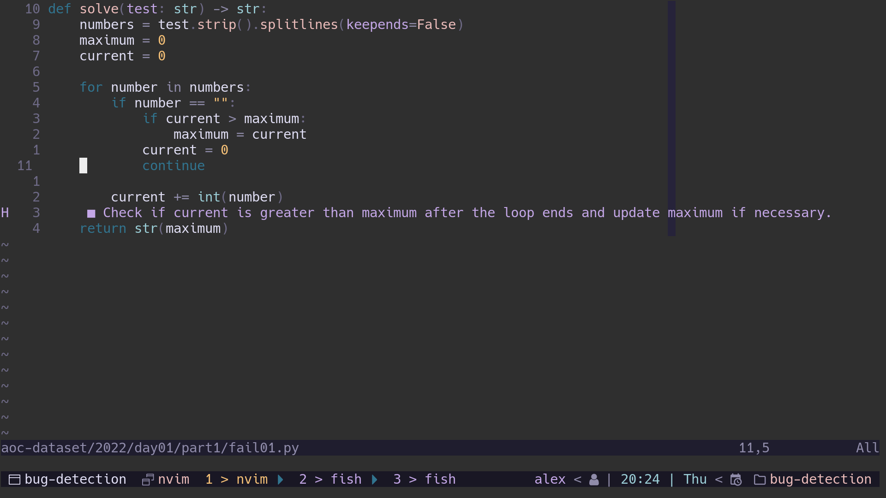

<div align="center">

# CodeHint
##### Get the best hints for the bugs in your code.

[](http://www.lua.org)
[](https://neovim.io)
</div>



<div align="center">

[](http://www.youtube.com/watch?v=0rjjgwFgHLU "AI Fixes Bugs")

The demo for the plugin is available on my [YouTube](https://www.youtube.com/channel/UCQfbjXwtGuJ-7hDMmAm1-rA) channel.

Note that the demo uses an older OpenAI model.

</div>

## ⇁ Installation
* neovim 0.9.0+ required
* curl 7.87.0+ required
* install using your favorite plugin manager (`packer` in this example)

```lua
use({'alexjercan/codehint'})
```

## ⇁ Setup

To setup the `codehint` plugin you need an OpenAI account and an api key. Then
you have to call the setup function for the plugin and provide the api key in
the input menu. Here is an example with the default values of the config:

```lua
require("codehint").setup({
    api = {
        model = "gpt-3.5-turbo",
        endpoint = "https://api.openai.com/v1/chat/completions",
    },
    use_env = false,
})
```

## ⇁ Code Hints

To get the code hints open up the buggy source code file and call the `hint`
function:

```lua
:lua require("codehint").hint()
```

This should provide you with a diagnostic message that displays the hint for
your problem.

## ⇁ Tech

This plugin makes use of the Chat API from OpenAI and can use the
gpt-4, gpt-3.5-turbo models. We use the default values in the config, but this
can change in the future to allow users to tweak their experience.

The plugin works by using a system prompt on the Assistant to set the mood
_blushes_ as a debugger. Then it takes the text from the current buffer.  It
then uses the Chat API to get a response and shows it using the diagnostics
api.

The current system prompt used with ChatGPT is


<pre>
```text
You are an expert software  developer. Your job is to find the
bugs in the given source code. First you have to provide a step by step
analysis of the source code. Based on the analysis provide a list of the most
probable bugs in a human readable format. Your output must be in JSON format.
You will have to output a list with the name "analysis" which contains the step
by step analysis of the source code. Then you will have to output the list of
bugs, with the name "bugs", which contains objects with the keys "line" for the
line number, "bug" which contains the description of the bug, and "hint" which
is a more human readable hint that can be used to guide the user to fix the
bug, without explicitly stating the bug to obviously.

For example, given the following source code
&#96;&#96;&#96;
if __name__ == "__main__":
    n = input()
    for i in range(1, n):
        if i % 2 == 0:
            print(i)
&#96;&#96;&#96;

Your output should be:
&#96;&#96;&#96;
{
    "analysis": [
        "The program starts by reading the input from standard input into the variable n.",
        "Then, we iterate from 1 to n using the range function.",
        "Then we check if the index is divisible by 2 using the modulo operation.",
        "If the number is divisible by 2 we print it.",
        "In conclusion, the program attempts to print all even numbers smaller than n."
    ],
    "bugs": [
        {
            "line": 1,
            "bug": "input returns a string, but we use n later into the range function \
which requires an int. You can use the int function to fix that and use \
`n = int(input())`",
            "hint": "check the way you handle the input"
        }
    ]
}
&#96;&#96;&#96;
```
</pre>

## ⇁ Vim Config

An example of config can be seen below. It just maps the `leader` +
`h` keys to call the hint function. And it calls for setup on, which will
require the OpenAI API key to be entered. The key will be saved on the nvim
path at `~/.local/share/nvim/.openairc`.

```lua
local codehint = require("codehint")

codehint.setup({
    api = {
        model = "gpt-3.5-turbo",
        endpoint = "https://api.openai.com/v1/chat/completions",
    },
    use_env = false,
})

vim.keymap.set("n", "<leader>h", codehint.hint)
```

## ⇁ Limitations

* Tested only with gpt-3.5-turbo
